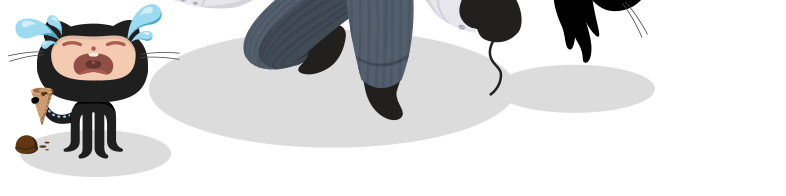
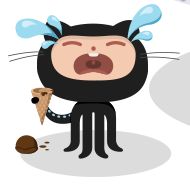

# Nuggan

Image optimizer HTTP micro-service & utilities based on [libvips](https://libvips.github.io/libvips/).

## Motivation

Many examples can be found around the Web to create an application that optimizes images, but most of the time it requires additional service (e.g. [S3 to storage optimized image](https://aws.amazon.com/blogs/compute/resize-images-on-the-fly-with-amazon-s3-aws-lambda-and-amazon-api-gateway/)) or it requires intrusive control over your existing Web or DNS.

Nuggan acts as a very simple image proxy, compatibility with any already existing Web hosted images (see `groupedBaseUrls` setting in [Configuration](#configuration)).

*See [Deployment](#deployment)*

## Usage

Run as a standalone HTTP service on port `8080` (see [Configuration](#configuration) bellow):

    ./nuggan -server ':8080' -server-config server.conf

Then images available through configured based URL are served: e.g. http://localhost:8080/optimg/0/0/-/-/-/-/-/_1_L2ZvbGxvdy10aGUtaGVyZC81MTIvZ2l0aHViX3JpZ2h0LTUxMi5wbmc=/image.png

The original image is resolved according the given `base64Url` (in previous example `_1_L2ZvbGxvdy10aGUtaGVyZC81MTIvZ2l0aHViX3JpZ2h0LTUxMi5wbmc=`; see [`codec` acceptances](./src/codec_test.go)).

The original image is first cropped, if there is any crop parameter (otherwise cropped image = original image), then the service eventually resizes (if resize parameters are specified) the cropped image.

*See [Request format](#request-format)*

### Docker

Nuggan can be easily started as a [Docker](https://www.docker.com/) container.

    docker run --rm -P cchantep/nuggan:amazonlinux1

The default configuration in the container can be overridden with a volume.

```
docker run -v /tmp/custom.conf:/root/server.conf \
  --rm -P cchantep/nuggan:amazonlinux1
```

> The docker image can be built locally: `./scripts/docker-build.sh`

### Configuration

```
groupedBaseUrls = [
  [
    "https://upload.wikimedia.org/wikipedia/commons"
  ],
  [
    "https://cdn0.iconfinder.com/data/icons",
    "https://cdn1.iconfinder.com/data/icons"
  ],
  [
    "https://octodex.github.com/images"
  ]
]
routePrefix = "optimg" # default prefix
```

### Request format

The service accepts either `GET` or `HEAD` requests, with the following URL format.

    /:routePrefix/:cropX/:cropY/:cropWidth/:cropHeight/:resizeWidth/:resizeHeight/:compressionLevel/:base64Url

- `routePrefix`: Any request path prefix (not processed).
- `cropX`: Crop origin X (mandatory integer >= 0; 0 = left).
- `cropY`: Crop origin Y (mandatory integer >= 0; 0 = top).
- `cropWidth`: Crop width according the original image (optional integer >= 0 && <= original width OR "-").
- `cropHeight`: Crop height according the original image (optional integer >= 0 && <= original height OR "-").
- `resizeWidth`: Resize width (optional integer >= 0 && <= cropped width OR "-")
- `resizeHeight`: Resize height (optional integer >= 0 && <= cropped height OR "-").
- `compressionLevel`: Compression level (optional integer >= 0 OR "-").

#### Examples

The examples bellow correspond to the standalone service executed with the [default configuration](#configuration), for an [original image](https://octodex.github.com/images/poptocat_v2.png) matching the third group in `groupedBaseUrls` setting (see [Utilities](#utilities) to prepare an image URL).

**Example #1:** No-crop & no-resize (passthrough) [`../0/0/-/-/-/-/-/_2_L3BvcHRvY2F0X3YyLnBuZw==`](http://localhost:8080//optimg/0/0/-/-/-/-/-/_2_L3BvcHRvY2F0X3YyLnBuZw==/image.png)


**Example #2:** Only crop origin X=`110` and Y=`700` [`../110/700/-/-/-/-/-/_2_L3BvcHRvY2F0X3YyLnBuZw==`](http://localhost:8080/optimg/110/700/-/-/-/-/-/_2_L3BvcHRvY2F0X3YyLnBuZw==/image.png)



**Example #3:** Full crop with origin and width&height=`190` [`../110/700/190/190/-/-/-/_2_L3BvcHRvY2F0X3YyLnBuZw==`](http://localhost:8080/optimg/110/700/190/190/-/-/-/_2_L3BvcHRvY2F0X3YyLnBuZw==/image.png)



**Example #4:** Crop & resize by width=`128` [`../110/700/190/190/128/-/-/_2_L3BvcHRvY2F0X3YyLnBuZw==`](http://localhost:8080/optimg/110/700/190/190/128/-/-/_2_L3BvcHRvY2F0X3YyLnBuZw==/image.png)


**Example #5:** Crop & full resize by height (as height `96` < width `128`) [`../110/700/190/190/128/96/-/_2_L3BvcHRvY2F0X3YyLnBuZw==`](http://localhost:8080/optimg/110/700/190/190/128/96/-/_2_L3BvcHRvY2F0X3YyLnBuZw==/image.png)


**Example #6:** Crop & full resize by height (as width `128` < height `512`) [`../110/700/190/190/128/512/-/_2_L3BvcHRvY2F0X3YyLnBuZw==`](http://localhost:8080/optimg/110/700/190/190/128/512/-/_2_L3BvcHRvY2F0X3YyLnBuZw==/image.png)


**Example #7:** Crop & full resize with compression level=`9` (best compression: from 12.5K to 11.96K) [`../110/700/190/190/128/512/9/_2_L3BvcHRvY2F0X3YyLnBuZw==`](http://localhost:8080/optimg/110/700/190/190/128/512/9/_2_L3BvcHRvY2F0X3YyLnBuZw==/image.png)


### Utilities

Encode an image URL to a base64Url accepted by the service (according the `-server-config`):

```
./nuggan -server-config server.conf -encode-url https://octodex.github.com/images/poptocat_v2.png
2020/01/12 16:06:07 Encode 'https://octodex.github.com/images/poptocat_v2.png':

	_2_L3BvcHRvY2F0X3YyLnBuZw==
...
```

## Build

The project is built using [Go](https://golang.org/) 1.13+.

[](https://circleci.com/gh/cchantep/nuggan)

*Prerequisites:*

- [libvips](https://libvips.github.io/libvips/install.html)
  - OSX: `port install vips`

Then to execute the incremental build (produces the `nuggan` executable):

    go build

Run the tests:

    go test -v nuggan