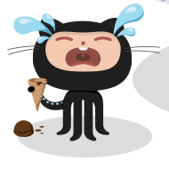

# API Reference

## Request Format

All requests use the following URL format:

```
/:routePrefix/:cropX/:cropY/:cropWidth/:cropHeight/:resizeWidth/:resizeHeight/:compressionLevel/:base64Ref
```

The service accepts both `GET` and `HEAD` requests.

## Path Parameters

- **`routePrefix`**: Any request path prefix (not processed by Nuggan). Typically configured as `optimg` but can be any value.

- **`cropX`**: Crop origin X coordinate (mandatory integer ≥ 0; 0 = leftmost edge).

- **`cropY`**: Crop origin Y coordinate (mandatory integer ≥ 0; 0 = top edge).

- **`cropWidth`**: Width of crop region according to the original image (optional integer ≥ 0 && ≤ original width OR `"-"`). Use `"-"` to skip cropping by width.

- **`cropHeight`**: Height of crop region according to the original image (optional integer ≥ 0 && ≤ original height OR `"-"`). Use `"-"` to skip cropping by height.

- **`resizeWidth`**: Target resize width (optional integer ≥ 0 && ≤ cropped width OR `"-"`). Use `"-"` to skip resize by width.

- **`resizeHeight`**: Target resize height (optional integer ≥ 0 && ≤ cropped height OR `"-"`). Use `"-"` to skip resize by height.

- **`compressionLevel`**: JPEG/PNG compression level (optional integer ≥ 0 OR `"-"`). Use `"-"` to use default compression.

- **`base64Ref`**: Base64-encoded image reference. Format depends on strict mode setting (see below).

## Image Reference Encoding

### Strict Mode Disabled

If strict mode is disabled in your configuration, `base64Ref` can be any absolute URL encoded with Base64.

Example: Direct Base64 encoding of a public image URL.

### Strict Mode Enabled

If strict mode is enabled, `base64Ref` must use the following format:

```
_{groupIndex}_{base64ImagePath}
```

- **`groupIndex`**: 0-based index of the URL group to use from `groupedBaseUrls` configuration.
- **`base64ImagePath`**: Base64-encoded image path that can be appended to any base URL from the specified group to resolve the absolute image URL.

Example: `_2_L3BvcHRvY2F0X3YyLnBuZw==`

Where:
- `2` is the group index (third group in `groupedBaseUrls`)
- `L3BvcHRvY2F0X3YyLnBuZw==` is the Base64-encoded path `/poptocat_v2.png`

For validation details, see the [codec acceptances test](../src/codec_test.go).

## Examples

All examples below use the default configuration with `routePrefix = "optimg"`. They reference the [Poptocat image](https://octodex.github.com/images/poptocat_v2.png) from the third group in `groupedBaseUrls`.

The original image is first **cropped** (if parameters are specified), then **resized** (if parameters are specified).

### Example #1: No-crop & no-resize (passthrough)

URL: `../0/0/-/-/-/-/-/_2_L3BvcHRvY2F0X3YyLnBuZw==`

Result: Original image served as-is.


### Example #2: Crop only (origin X=110, Y=700)

URL: `../110/700/-/-/-/-/-/_2_L3BvcHRvY2F0X3YyLnBuZw==`

Result: Cropped from (110, 700) to bottom-right corner.


### Example #3: Full crop (origin X=110, Y=700, width=190, height=190)

URL: `../110/700/190/190/-/-/-/_2_L3BvcHRvY2F0X3YyLnBuZw==`

Result: 190×190 pixel crop starting at (110, 700).


### Example #4: Crop & resize (crop to 190×190, then resize width to 128)

URL: `../110/700/190/190/128/-/-/_2_L3BvcHRvY2F0X3YyLnBuZw==`

Result: 190×190 crop, then resized to 128 pixels (width constrained).


### Example #5: Crop & full resize (crop to 190×190, resize to 128×96)

URL: `../110/700/190/190/128/96/-/_2_L3BvcHRvY2F0X3YyLnBuZw==`

Result: 190×190 crop, then resized to 128×96 pixels.


### Example #6: Crop & full resize (crop to 190×190, resize to 128×512)

URL: `../110/700/190/190/128/512/-/_2_L3BvcHRvY2F0X3YyLnBuZw==`

Result: 190×190 crop, then resized to 128×512 pixels.



### Example #7: Crop, resize & compress (compression level=9)

URL: `../110/700/190/190/128/512/9/_2_L3BvcHRvY2F0X3YyLnBuZw==`

Result: 190×190 crop, resize to 128×512, compressed with level 9 (best compression). File size reduced from 12.5K to 11.96K.


## Configuration Setup

For detailed configuration instructions and parameter explanations, see the [Usage Guide](./usage.md).
