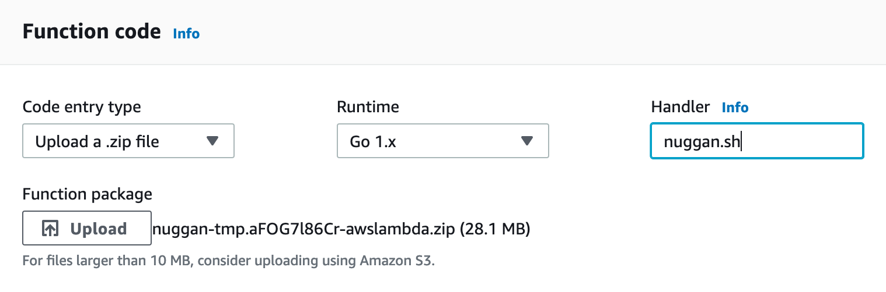
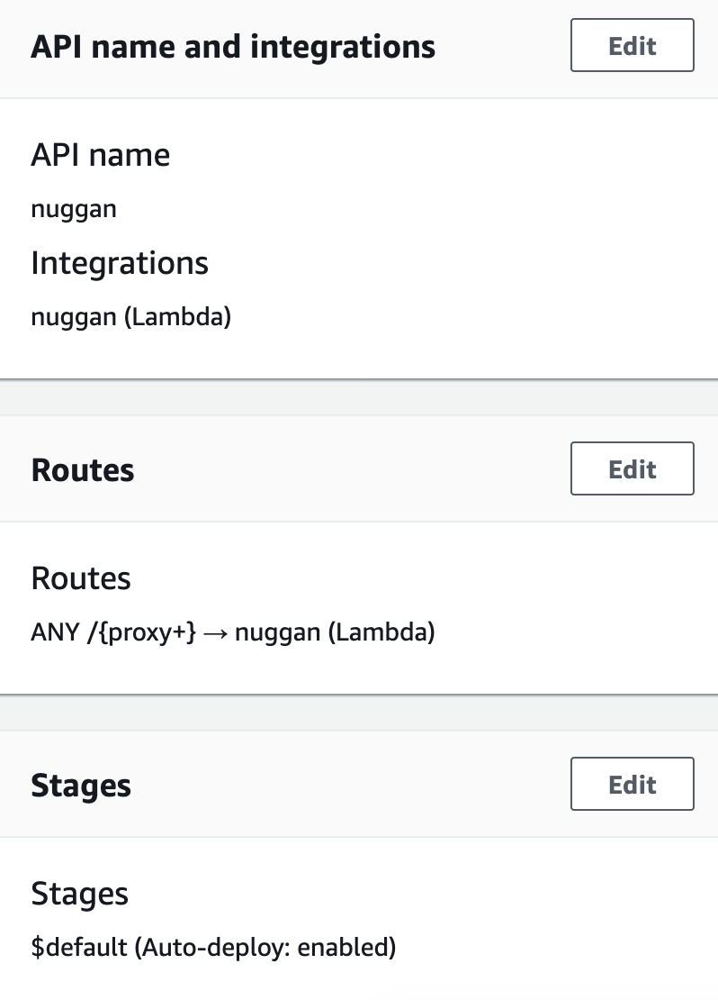

# Deployment

Nuggan can be deployed as a standalone service or on serverless platforms like AWS Lambda.

**Best Practice**: Access a deployed Nuggan through a [CDN](https://en.wikipedia.org/wiki/Content_delivery_network) for optimal performance and caching.

## Standalone Deployment

Deploy Nuggan as a standalone HTTP service behind a reverse proxy, load balancer, or directly:

```sh
./nuggan -server ':8080' -server-config server.conf
```

See [Usage Guide](./usage.md) for configuration options and examples.

## Docker Deployment

See the [Usage Guide — Docker section](./usage.md#docker) for containerized deployment instructions.

## AWS Lambda

Deploy Nuggan as a [Go Lambda Handler](https://docs.aws.amazon.com/lambda/latest/dg/go-programming-model.html) on AWS.

### Step 1: Create Lambda Distribution

Create a compatible AWS Lambda deployment package:

```sh
./scripts/aws-lambda-build.sh
```

This generates a ZIP file compatible with the Go 1.x runtime.

### Step 2: Create Lambda Function

In the AWS Management Console:

1. Navigate to **Lambda** and click **Create Function**.
2. Configure:
   - **Function name**: Choose any name (e.g., `nuggan-image-optimizer`)
   - **Runtime**: `Go 1.x`
   - **Permissions**: Keep defaults
3. Click **Create Function**.

### Step 3: Upload Function Code

In the created function page:

1. Under **Function code**, change **Code entry type** to `Upload a .zip file`.
2. Click **Upload** and select the ZIP file from Step 1.
3. Set **Handler** to `nuggan.sh`.



4. Click **Save**.

### Step 4: Create API Gateway

In the AWS Management Console:

1. Navigate to **API Gateway**.
2. Choose **HTTP API** and click **Build**.
3. Under **Create and configure integrations**:
   - **Integration type**: `Lambda`
   - **Lambda function**: Select the Nuggan function created above
   - **API name**: Choose any name (e.g., `nuggan-api`)
4. Click **Next**.

### Step 5: Configure Routes

In the **Create and configure routes** screen:

- Set **Resource path** to `/{proxy+}` (this forwards all requests to the Lambda function)
- Click **Next**.

### Step 6: Create Stages

In the **Create and configure stages** screen, keep the default values and click **Create**.



### Deployment Complete

Your Nuggan service is now deployed and accessible through the API Gateway endpoint. Use the endpoint URL provided by API Gateway to make image requests.

**Example request:**
```
https://<api-gateway-id>.execute-api.us-east-1.amazonaws.com/optimg/0/0/-/-/-/-/-/_2_L3BvcHRvY2F0X3YyLnBuZw==/image.png
```

Replace the base URL and parameters as needed for your use case.
